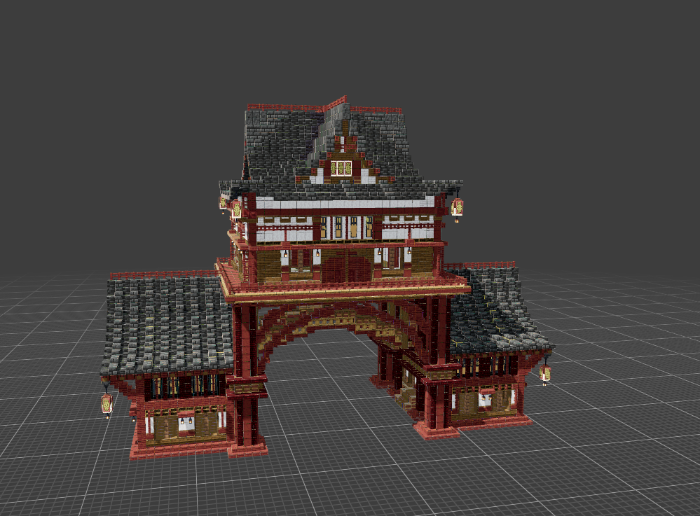
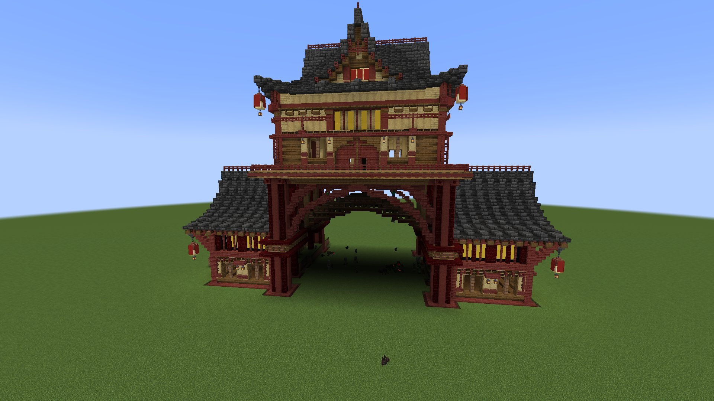
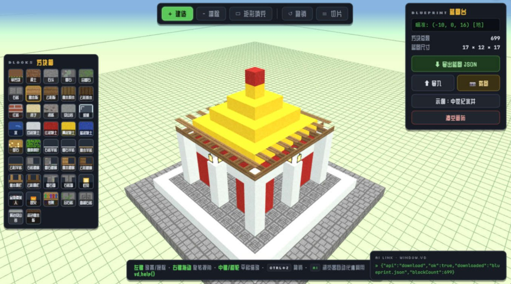
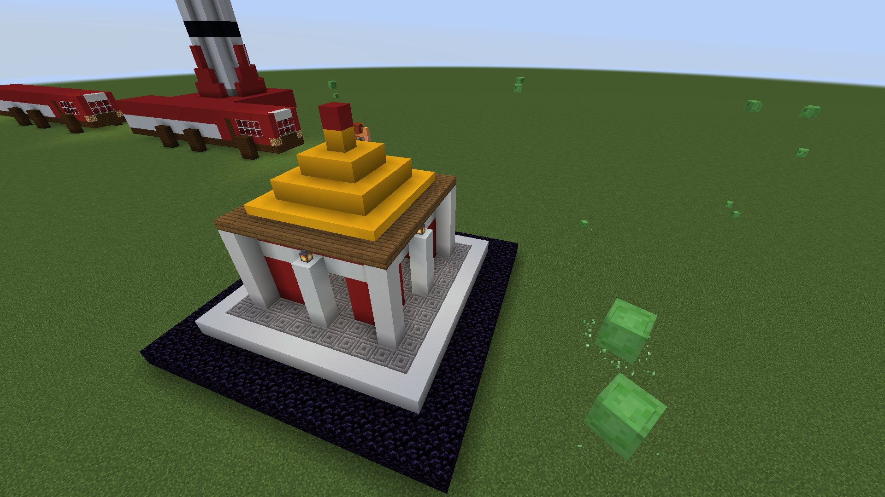
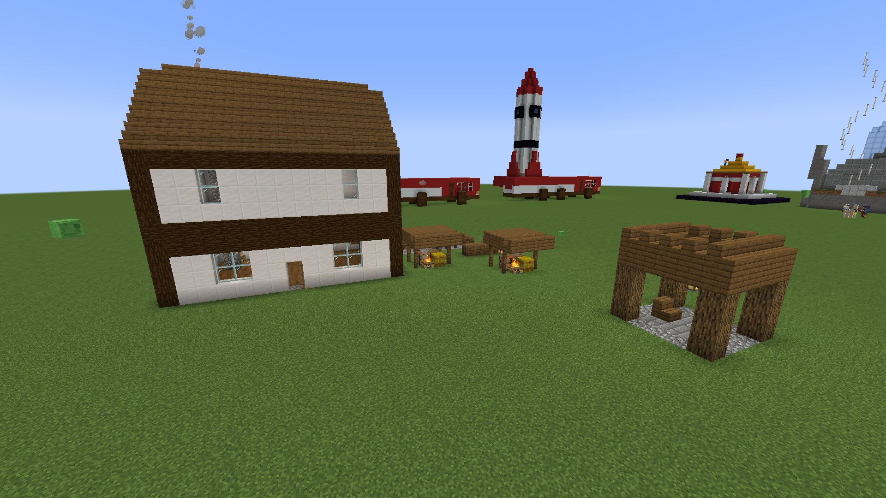
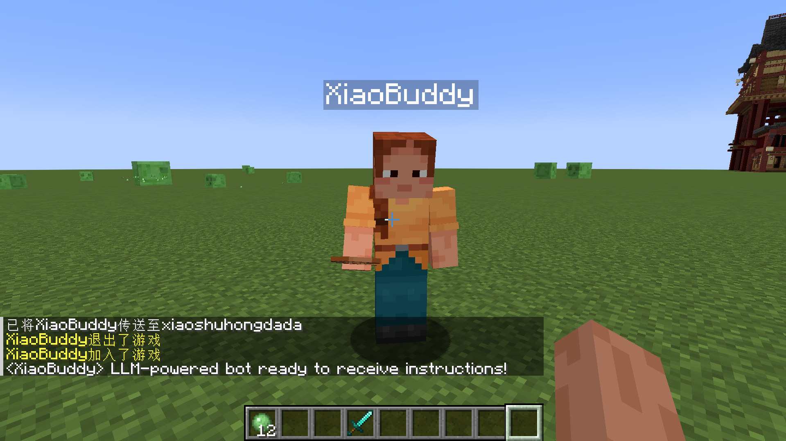
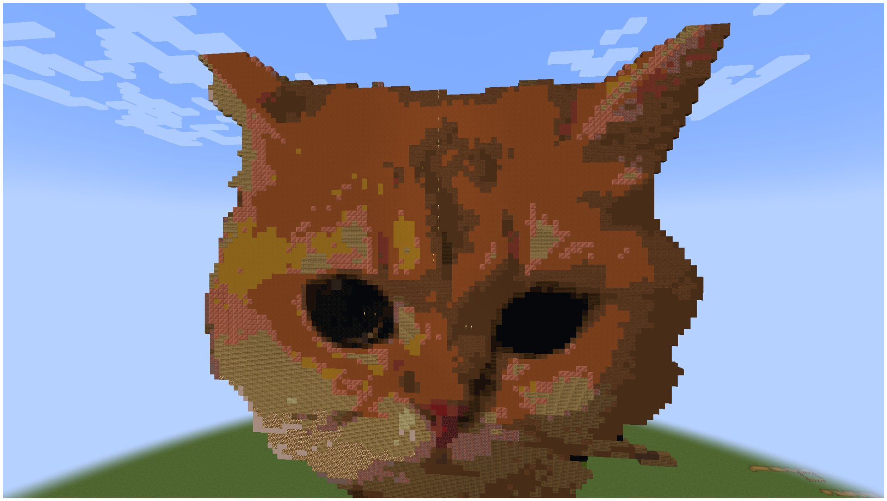

# Ai-build-for-minecraft

本技能主要设计给想在Minecraft中建一些东西，但总是碍于自己的精力或者动手能力不强而没办法真的做出来的“准”建筑党，同时也可以成为想要制作大规模建筑乃至建筑群的建筑党的超级提效工具。

具体来说，它主要能做三件事：

- **根据你的描述设计蓝图。** 一句话需求，AI 在网页体素设计器中自主完成三维建模并截图自查；也可以把你手中现成的建模文件转换成蓝图然后建造（避免了多加模组）；或者发给它照片，然后给你还原成像素建筑（超强，每个过去MC玩家都做过的梦）。
- **根据你的蓝图完成建筑。** agent通过mcp操控内部工人执行建筑指令（弱依赖视觉能力，所以非常省token，不是看一块建一块）；也可以通过表演模式看到慢放过程。
- **根据你的需求完成建筑微调。** 增删改查信手拈来，不满意可以一直修甚至推倒重来。

**首次使用请先运行 mc-env 技能完成环境配置。** 全部操作通过 minecraft-mcp-server 提供的 MCP 工具连接游戏，蓝图文件是贯穿设计、建造、修改的唯一数据源。

## 整体架构

```
mc-env（环境配置与体检，首次使用先执行）
        ↓ 环境就绪后
mc-design                     mc-build                      mc-modify
┌──────────────────┐   蓝图   ┌───────────────────┐  差量补丁 ┌──────────────────┐
│ 网页设计器、      │ ──────→ │ 秒落（默认）或      │ ───────→ │ 差量计算后仅写入   │
│ 既有文件转换或    │         │ 表演模式回放，      │          │ 差异格，修改再同步     │
│ 图片还原产出      │         │ 逐格回读验收        │          │ 蓝图并验收         │
│ JSON 与 litematic│         │                   │          │                  │
└──────────────────┘         └───────────────────┘          └──────────────────┘
```
## 架构优势

弱依赖ai能力，ai能力可能只会影响建筑审美。在环境配的没问题的前提下，确保所有主流ai都能顺利快速准确完成建造（deepseek,minmax,kimi,glm,doubao,hy3。用不着去请gpt老祖出山）

## 技能构成

| 技能 | 职责 |
|------|------|
| mc-env | 环境配置与体检，第一次使用时先执行 |
| mc-design | 体素设计与蓝图产出，含自主设计与图片还原两条路线 |
| mc-build | 建造与验收 |
| mc-modify | 微调建筑 |

每个技能目录内的 SKILL.md 是完整说明书，设计器的 AI 接口、转换脚本的用法、建造与验收的细则、差量计算的规则等全部细节都在里面。

## 快速开始

环境怎么准备、两种上手方式（让 Agent 带着配置，或自己照清单手动配置），见 [`环境配置.md`](环境配置.md)。安装技能，以 WorkBuddy 为例：

```bash
git clone https://github.com/ChenZeLongKnight/Ai-build-for-minecraft.git
cp -r Ai-build-for-minecraft/mc-env \
      Ai-build-for-minecraft/mc-design \
      Ai-build-for-minecraft/mc-build \
      Ai-build-for-minecraft/mc-modify \
      ~/.workbuddy/skills/
```

前置依赖：Minecraft Java 版，单人世界对局域网开放并开启作弊；[minecraft-mcp-server-blueprint](https://github.com/ChenZeLongKnight/minecraft-mcp-server-blueprint) 作为连接游戏的 MCP 引擎，注意必须使用本仓库改造的mcp，官方仓库目前没有蓝图工具；[browser-use](https://github.com/browser-use/browser-use) 浏览器自动化 MCP（重要，但目前大多数主流agent，如workbuddy,zcode都会内置，如果没有则同样可以命令agent自行装配，建议下载到本地，提升设计速度）；图片还原路线另需 Python 3.10 以上与若干依赖包（运行过程中agent会自动帮你装不用担心），模型权重见 [`models/README.md`](models/README.md)，仓库内附轻量版开箱可用。

## 演示

**日式拱门：设计器蓝图与实际建造对比。**

<p align="center">
  
  
</p>

**小型宫殿：AI 自主设计与落地微调。**

<p align="center">
  
  
</p>

**建筑群。** 图中全部建筑均由智能体自主设计并建造完成。



**建造者 XiaoBuddy。** 由 WorkBuddy 驱动的建筑师机器人，正在游戏中接收指令。



**图片还原：照片自动转建筑。** 一张猫的照片经脚本自动还原后写入世界：脚本自己识别主体、剔除背景、逐格配色、生成蓝图并建造，游戏内与原图一一对应。

<p align="center">
  
  
</p>
